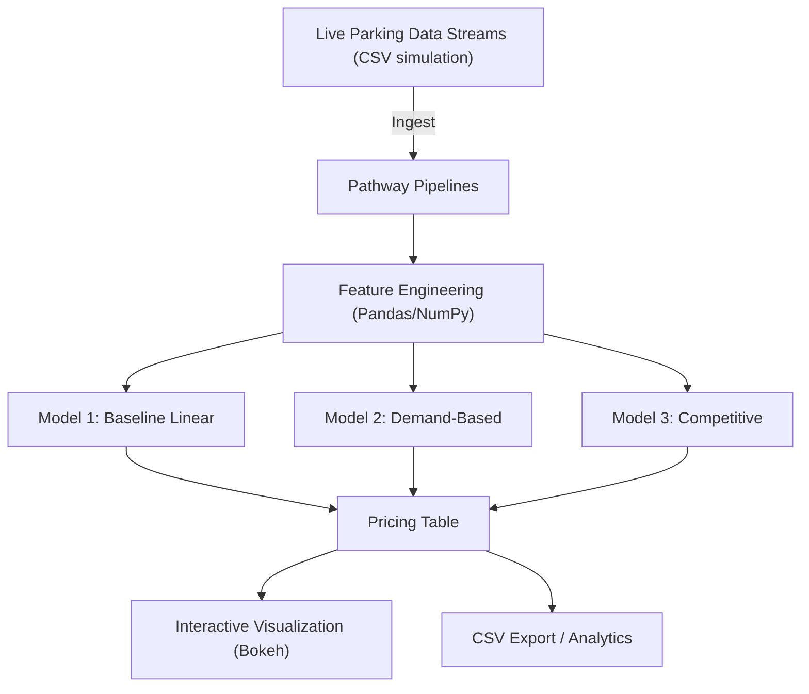
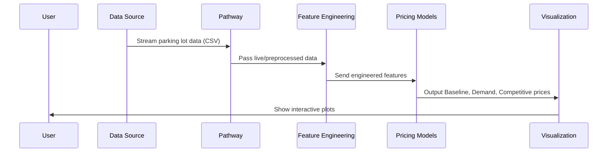

This is the GitHub Repo of Jateen Ramteke.
# Dynamic Pricing for Urban Parking Lots

## Overview

This project implements a **real-time, data-driven dynamic pricing engine for urban parking lots**, tackling the inefficiencies of static pricing in metropolitan areas. The solution ingests live data from 14 city parking lots, engineers relevant features, and applies three progressively sophisticated dynamic pricing models:

1. **Baseline Linear Model**: Prices are adjusted based on occupancy.
2. **Demand-Based Model**: Considers queue length, local traffic, vehicle type, and special events.
3. **Competitive Pricing Model**: Incorporates pricing and capacity of nearby lots to optimize revenue and space utilization.

All models are visualized interactively to compare their effectiveness.

---

## Tech Stack

- **Python**: Data processing, modeling, and orchestration.
- **Numpy & Pandas**: Feature engineering and data manipulation.
- **[Pathway](https://pathway.com/)**: Real-time data streaming and pipeline simulation.
- **[Bokeh](https://bokeh.org/)**: Interactive data visualization.
- **[Geopy](https://geopy.readthedocs.io/)**: Geospatial calculations for competitive pricing.
- **[Google Colab](https://colab.research.google.com/)**: Prototyping and reporting.

---

## High-Level Architecture



---

## Project Architecture & Workflow

### 1. Data Ingestion & Preprocessing
- **Source**: Simulated real-time data for 14 parking lots (location, occupancy, queue, traffic, vehicle type, event flags).
- **Processing**: 
  - Combine date and time into a timestamp.
  - Encode categorical features numerically for ML compatibility.
  - Normalize relevant features for robust modeling.

### 2. Feature Engineering
- Map vehicle and traffic types to numerical weights.
- Normalize queue lengths and special events.
- Prepare a unified streaming CSV (`parking_stream_all.csv`) for simulation.

### 3. Dynamic Pricing Models
- **Baseline Linear**: Updates price linearly with occupancy/capacity ratio.
- **Demand-Based**: Weighted sum of occupancy, queue, traffic, vehicle type, and special events drives price (normalized and bounded).
- **Competitive**: Integrates spatial (lat/lon) and temporal proximity. If the lot is full and nearby lots are cheaper, price drops. If neighbors are more expensive, price can increase.

### 4. Real-Time Simulation (Pathway)
- Uses Pathway to replay CSV as a live stream.
- (Optional extension) Deploys all models as streaming Pathway operators for true real-time inference.

### 5. Visualization
- **Bokeh**: Interactive time series plots for each lot, comparing the three pricing models.
- **Panel**: (Optional) For dashboard deployment.

---

## Workflow Diagram



---

## Key Features

- **Flexible Model Design**: Easily tuneable parameters for each model for experimentation.
- **Scalability**: Pathway enables seamless transition from batch analysis to streaming.
- **Competitive Awareness**: Geo-spatial proximity logic for price optimization.
- **Visualization**: Directly compare model outputs for business insight.

---

## How to Run

1. **Install dependencies** (in Jupyter or Google Colab):
   ```python
   !pip install pathway bokeh panel geopy
   ```

2. **Load notebook**: Open `Capstone Project.ipynb` in Jupyter or Google Colab.

3. **Update dataset path**: Replace `dataset.csv` with the actual dataset location.

4. **Run all cells**. Visualizations will appear inline.

---

## Customization & Next Steps

- **Pathway Integration**: For true streaming, deploy all model logic as Pathway operators.
- **Rerouting Suggestions**: Inform users if a lot is full but cheaper space is nearby.
- **Additional Analytics**: Visualize queue dynamics, occupancy heatmaps, and revenue projections.
- **API Deployment**: Wrap models in a Flask/FastAPI app for real-world integration.

---

## References

- [Pathway Docs](https://pathway.com/docs/)
- [Bokeh Tutorials](https://docs.bokeh.org/en/latest/docs/user_guide.html)
- [Geopy Usage](https://geopy.readthedocs.io/en/stable/)

---

## Contributors

- Project by: Jateen Ramteke, Summer Analytics 2025

---
